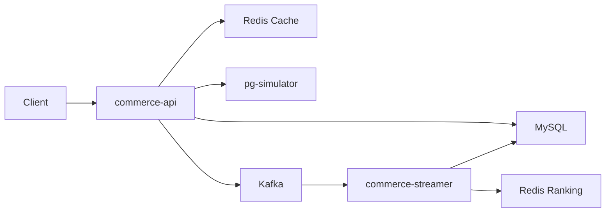
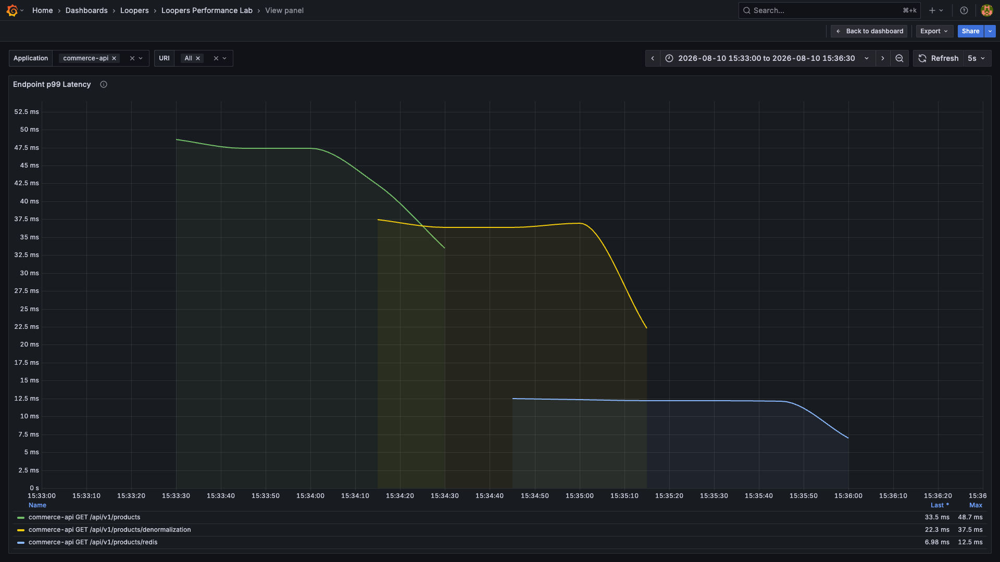
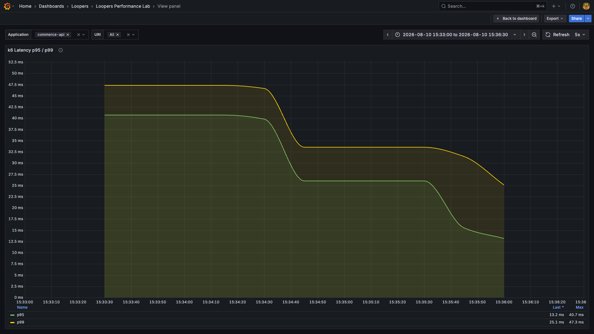

# LOOPERS E-commerce Backend

실제 이커머스의 주문·결제 흐름에서 발생할 수 있는 동시성, 데이터 정합성, 외부 시스템 장애와 조회 성능 문제를 직접 구현하고 검증한 백엔드 프로젝트입니다.

기술을 나열하는 데 그치지 않고, **어떤 문제를 해결하기 위해 사용했는지**와 **실험 결과가 무엇이었는지**를 기록하는 것을 목표로 했습니다.

- [요구사항](docs/design/01-requirements.md)
- [시퀀스 다이어그램](docs/design/02-sequence-diagrams.md)
- [클래스 다이어그램](docs/design/03-class-diagrams.md)
- [개체 관계도(ERD)](docs/design/04-erd.md)
- [성능 실험 가이드](docs/performance/README.md)

## 1. 프로젝트 소개

### 해결하려는 문제

- 같은 상품에 주문이 몰려도 재고와 포인트가 음수가 되지 않도록 한다.
- 한정 수량 쿠폰이 중복되거나 보유 수량을 초과해 사용되지 않도록 한다.
- 외부 결제 대행사(Payment Gateway, PG) 요청 실패나 결제 실패가 주문·재고·쿠폰 상태를 어긋나게 만들지 않도록 한다.
- 데이터가 증가할 때 상품 조회가 느려지는 원인을 측정하고, 조회 구조별 결과를 비교한다.
- 상품 이벤트 발행과 랭킹 집계를 분리하고, 이벤트 처리 상태를 추적할 수 있도록 한다.

### 주요 기능

| 영역 | 구현 내용 |
| --- | --- |
| 상품 | 브랜드별 상품 목록·상세 조회, 가격·좋아요·등록일 정렬, 페이지 조회 |
| 좋아요 | 상품 좋아요 등록·취소, 좋아요 수 갱신, 상품 이벤트 발행 |
| 주문 | 여러 상품 주문, 재고 차감, 쿠폰 적용, 주문 금액 계산 |
| 결제 | 카드·포인트 결제, PG 연동, 결제 결과 콜백, 실패 시 재고·쿠폰 보상 처리 |
| 동시성 | 재고·포인트·쿠폰·좋아요 갱신에 비관적 락 적용, 재고·포인트·쿠폰 동시성 테스트 |
| 랭킹 | Kafka 이벤트 집계, Redis Sorted Set 기반 일간 랭킹, Spring Batch 기반 주간·월간 랭킹 |
| 이벤트 | Spring 이벤트로 주문 후속 처리를 분리하고, 좋아요 이벤트의 아웃박스 상태 관리 |

### 시스템 구조



```text
Root
├── apps                         # 실행 애플리케이션
│   ├── commerce-api             # 상품·주문·결제 API
│   ├── commerce-streamer        # Kafka 소비·랭킹 집계·배치
│   └── pg-simulator             # 외부 PG 시뮬레이터
├── modules                      # 재사용 가능한 인프라 설정
│   ├── jpa
│   ├── redis
│   └── kafka
└── supports                     # 공통 부가 기능
    ├── jackson
    ├── monitoring
    └── logging
```

### 구현 범위

교육 과정에서 제공된 기본 멀티 모듈 환경과 임시 PG 시뮬레이터를 기반으로 다음 영역을 직접 구현하고 확장했습니다.

- 상품·좋아요·주문·재고·쿠폰·포인트·결제 도메인과 API
- 비관적 락을 이용한 동시성 제어와 동시 요청 검증
- Spring Event, Kafka, 이벤트 아웃박스를 이용한 후속 처리 분리
- Redis와 Spring Batch를 이용한 일간·주간·월간 상품 랭킹
- Testcontainers 기반 통합 테스트와 결제 전체 흐름 테스트
- k6, Prometheus, Grafana를 이용한 상품 조회 성능 실험 환경

## 2. 기술 스택과 적용 이유

| 구분 | 기술 | 적용 이유 |
| --- | --- | --- |
| 언어·프레임워크 | Java 25, Spring Boot 4.1.0, Spring Cloud 2025.1.2 | 트랜잭션, 이벤트, 배치 등 이커머스 흐름에 필요한 기능을 일관된 방식으로 구현하기 위해 사용 |
| 데이터베이스 | MySQL, Spring Data JPA, QueryDSL | 주문 데이터의 트랜잭션 정합성을 지키고, 상품 필터·정렬 조건을 표현하기 위해 사용 |
| 동시성 제어 | JPA Pessimistic Lock | 같은 재고·쿠폰·포인트·상품 행을 동시에 변경할 때 갱신 손실과 초과 사용을 막기 위해 사용 |
| 캐시·랭킹 | Redis, Sorted Set | 반복 상품 조회를 캐시하고, 점수 순서가 필요한 상품 랭킹을 빠르게 조회하기 위해 사용 |
| 비동기 처리 | Spring Event, Kafka | 주문의 후속 처리와 상품 이벤트 집계를 핵심 요청 흐름에서 분리하기 위해 사용 |
| 이벤트 추적 | Outbox 상태 관리 | 좋아요 이벤트의 생성·전송 성공·실패 상태를 저장해 발행 결과를 추적하기 위해 사용 |
| 배치 | Spring Batch | 일간 데이터를 청크 단위로 읽어 주간·월간 랭킹으로 집계하기 위해 사용 |
| 외부 연동 | OpenFeign, Resilience4j Circuit Breaker | PG 호출 코드를 분리하고, 외부 시스템 장애가 애플리케이션 전체로 번지는 것을 줄이기 위해 사용 |
| 테스트 | JUnit 5, Testcontainers, Awaitility | 실제 MySQL·Redis·Kafka와 가까운 환경에서 동시성·비동기·통합 흐름을 검증하기 위해 사용 |
| 성능 관측 | k6, Prometheus, Grafana | 요청 지연시간과 오류율뿐 아니라 서버·JVM·DB 연결 풀 상태를 같은 시간대에 관찰하기 위해 사용 |

## 3. 성능 및 정합성 실험

### 실험 목적

상품 목록 조회에서 다음 세 경로를 같은 조건으로 호출해 지연시간과 오류 여부를 비교했습니다.

1. 정규화 조회: 좋아요 테이블을 집계해 정렬
2. 비정규화 조회: 상품 테이블의 `like_count`를 사용해 정렬
3. Redis 조회: 캐시가 준비된 상태에서 조회

이 실험은 HTTP 요청부터 애플리케이션과 MySQL·Redis까지 전체 경로를 확인하므로 k6와 Prometheus·Grafana를 사용했습니다. 자바 마이크로벤치마크 도구(Java Microbenchmark Harness, JMH)는 특정 Java 메서드나 알고리즘만 격리해 비교하는 경우에 사용합니다.

### 실험 환경과 데이터 규모

| 항목 | 조건 |
| --- | --- |
| 실행 장비 | MacBook Air, Apple M4 10-core, 24 GB RAM |
| 런타임 | Java 21.0.2, Spring Boot 3.4.4 |
| 관측 도구 | k6 2.1.0, Prometheus 3.5.0, Grafana 12.1.0 |
| 데이터 | 브랜드 500개, 상품 300,000개, 회원 10,000명, 좋아요 299,999개 |
| 정합성 사전 검증 | 상품의 `like_count`와 실제 좋아요 수 불일치 0건 |

### 실험 시나리오

- 브랜드 ID `1`, `2`, `34`를 순환 조회
- 페이지 `0`, `1`, 페이지 크기 `20`, 좋아요 수 내림차순 조건 사용
- 각 조회 경로에 초당 2건을 30초 동안 요청
- Redis 경로는 `setup` 단계에서 캐시를 미리 준비
- 상세 실행 방법은 [성능 실험 가이드](docs/performance/README.md)에 기록

### 측정 결과

| 조회 경로 | 요청 수 | 실제 처리량 | p50 | p95 | p99 | 최대 | 오류율 | 누락 요청 |
| --- | ---: | ---: | ---: | ---: | ---: | ---: | ---: | ---: |
| 정규화 조회 | 61 | 2.024 RPS | 35.65 ms | 44.65 ms | 46.74 ms | 47.05 ms | 0% | 0 |
| 비정규화 조회 | 61 | 2.014 RPS | 30.71 ms | 35.63 ms | 37.64 ms | 38.97 ms | 0% | 0 |
| Redis 조회 | 61 | 2.025 RPS | 10.91 ms | 18.24 ms | 39.65 ms | 54.53 ms | 0% | 0 |

`RPS`(Requests Per Second)는 초당 처리 요청 수입니다. `p50`은 전체 요청의 50%, `p95`는 95%, `p99`는 99%가 해당 시간 안에 끝났다는 뜻입니다.

### 결과 해석과 한계

- 이 실행에서는 세 경로 모두 초당 2건을 오류와 누락 없이 처리했습니다.
- Redis 조회의 p50과 p95가 가장 낮았지만, 61건만 수집한 스모크 테스트이므로 최대 처리량이나 일반적인 p99 성능을 뜻하지 않습니다.
- 실행 순서가 `비정규화 → 정규화 → Redis`였기 때문에 DB와 캐시 상태의 영향을 완전히 배제하지 못했습니다.
- 낮은 부하에서는 서버 자원 병목이 나타나지 않았습니다. 병목을 주장하려면 load·stress 실험을 각 3회 이상 반복하고 안정 구간에서 충분한 표본을 확보해야 합니다.

전체 원본과 해석은 [2026-08-04 로컬 스모크 테스트 결과](docs/performance/results/2026-08-04-local-smoke.md)에서 확인할 수 있습니다.

### Grafana 대시보드

Prometheus가 k6와 Spring Actuator 지표를 수집하고, Grafana의 `Loopers Performance Lab` 대시보드가 다음 항목을 함께 시각화합니다.

- k6 요청량, 오류율, p95·p99 지연시간
- Spring HTTP 요청 지연시간
- 자바 가상 머신(Java Virtual Machine, JVM) 메모리·CPU, Tomcat 스레드, HikariCP 데이터베이스 연결 풀

[Grafana 대시보드 설정](docker/grafana/dashboards/loopers-performance.json)은 실행 시 자동 등록됩니다. 관측 지표의 검증 내용은 [로컬 스모크 테스트 결과](docs/performance/results/2026-08-04-local-smoke.md)에 기록했습니다.

아래 화면은 2026-08-10에 같은 데이터 규모로 `정규화 → 비정규화 → Redis` 조회를 각각 2 RPS로 30초간 다시 실행해 캡처했습니다. 위 결과표는 2026-08-04 실행 기록이므로 실행 환경과 캐시 상태에 따라 세부 수치는 달라질 수 있습니다.

#### 엔드포인트별 서버 p99



정규화, 비정규화, Redis 조회 순서로 측정했으며, 이 실행 구간의 서버 p99 최대값은 각각 48.7ms, 37.5ms, 12.5ms로 관측됐습니다.

#### k6 요청 p95·p99



같은 시간대에 k6가 사용자 관점에서 측정한 p95·p99입니다. 세 실행 모두 오류율 0%, 누락 요청 0건으로 종료했습니다.

## 4. 실행 및 테스트 방법

### 사전 준비

- Java 25 (저장소의 `.tool-versions`는 mise `25.0.2`를 가리킵니다)
- Docker Desktop

Gradle Wrapper 9.1.0과 Gradle 데몬 JVM 기준은 `gradle/gradle-daemon-jvm.properties`에 따라 Java 25를 사용합니다. 로컬에 Java 25가 없으면 Gradle toolchain resolver가 호환 JDK를 자동으로 준비할 수 있습니다.

```shell
./gradlew --version
```

### 로컬 인프라 실행

```shell
docker compose -f ./docker/infra-compose.yml up -d
docker compose -f ./docker/infra-compose.yml ps -a
```

MySQL의 `loopers`, `paymentgateway` 데이터베이스와 Kafka 기본 토픽은 초기화 서비스가 멱등하게 준비합니다.

### 애플리케이션 실행

다음 애플리케이션을 각각 별도 터미널에서 실행합니다.

```shell
./gradlew :apps:pg-simulator:bootRun
./gradlew :apps:commerce-api:bootRun
./gradlew :apps:commerce-streamer:bootRun
```

| 애플리케이션 | API | Actuator |
| --- | --- | --- |
| commerce-api | http://localhost:8080 | http://localhost:8081 |
| pg-simulator | http://localhost:8082 | http://localhost:8083 |
| commerce-streamer | http://localhost:8084 | http://localhost:8085 |

```shell
curl -fsS http://localhost:8081/actuator/health
curl -fsS http://localhost:8083/actuator/health
curl -fsS http://localhost:8085/actuator/health
```

### 테스트 실행

```shell
./gradlew test
```

동시성 테스트만 실행하려면 다음 명령을 사용합니다.

```shell
./gradlew :apps:commerce-api:test --tests 'com.loopers.application.concurrency.ConcurrencyTest'
```

### 모니터링 실행

애플리케이션 실행 후 모니터링 환경을 시작합니다.

```shell
docker compose -f ./docker/monitoring-compose.yml up -d
```

- Kafka UI: http://localhost:9091
- Prometheus: http://localhost:9090
- Grafana: http://localhost:3000 (`admin` / `admin`)

성능 실험의 준비·실행·기록 방법은 [성능 실험 가이드](docs/performance/README.md)를 참고하세요.

## 5. 교육 템플릿 및 출처

이 프로젝트는 **Loopers에서 제공한 Spring + Java 교육용 멀티 모듈 템플릿**을 기반으로 만들었습니다.

- 제공된 범위: 기본 프로젝트·인프라 설정, 공통 지원 모듈, 임시 PG 시뮬레이터
- 직접 구현·확장한 범위: 이커머스 도메인과 API, 동시성 제어, 결제 실패 보상, 이벤트·랭킹 처리, 테스트, 성능 실험 환경과 결과 문서
