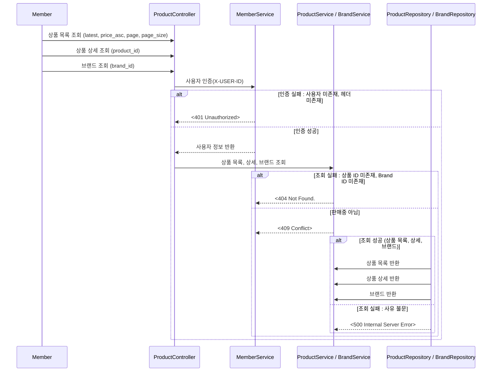
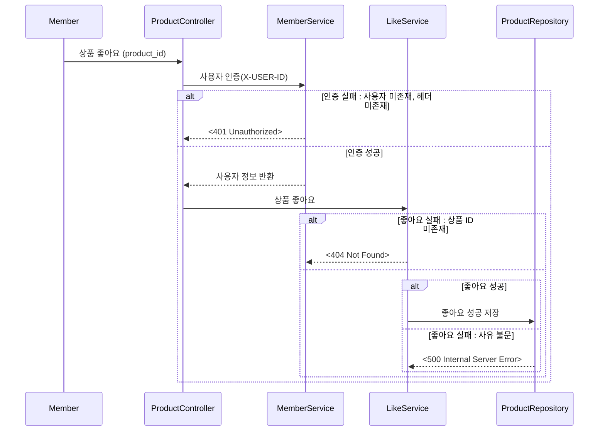
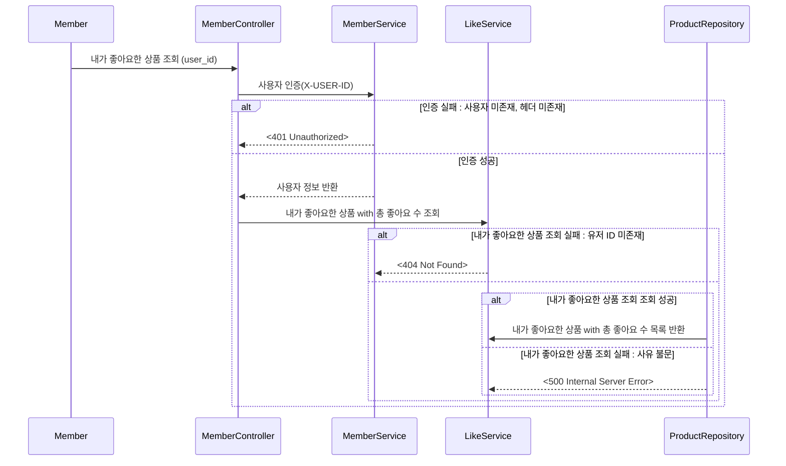
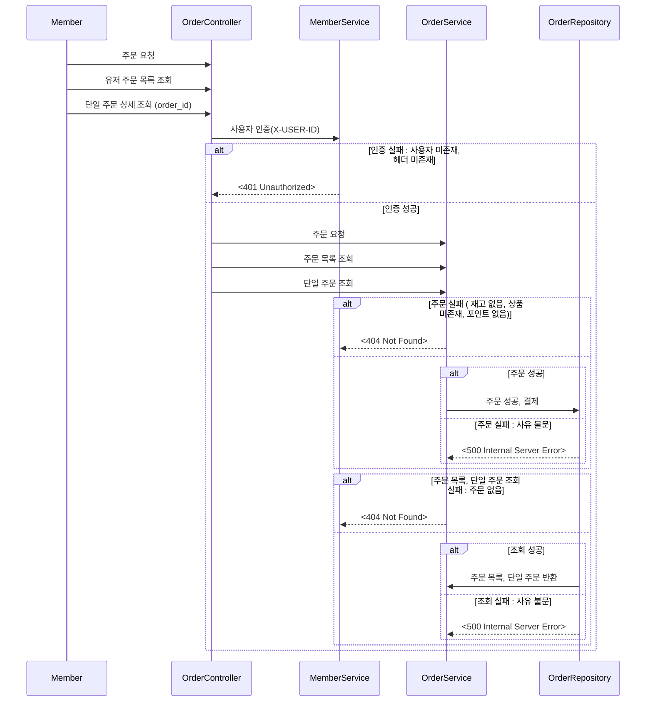

## 1. 상품 목록 / 상품 상세 / 브랜드 조회

```mermaid
sequenceDiagram
    participant M as Member
    participant PC as ProductController
    participant MS as MemberService
    participant PBS as ProductService / BrandService
    participant PBR as ProductRepository / BrandRepository
    M ->> PC: 상품 목록 조회 (latest, price_asc, page, page_size)
    M ->> PC: 상품 상세 조회 (product_id)
    M ->> PC: 브랜드 조회 (brand_id)
    PC ->> MS: 사용자 인증(X-USER-ID)
    alt 인증 실패 : 사용자 미존재, 헤더 미존재
        MS -->> PC: <401 Unauthorized>
    else 인증 성공
        MS -->> PC: 사용자 정보 반환
        PC ->> PBS: 상품 목록, 상세, 브랜드 조회
        alt 조회 실패 : 상품 ID 미존재, Brand ID 미존재
            PBS -->> MS: <404 Not Found.
        else 판매중 아님
            PBS -->> MS: <409 Conflict>
            alt 조회 성공 (상품 목록, 상세, 브랜드)
                PBR ->> PBS: 상품 목록 반환
                PBR ->> PBS: 상품 상세 반환
                PBR ->> PBS: 브랜드 반환
            else 조회 실패 : 사유 불문
                PBR -->> PBS: <500 Internal Server Error>
            end
        end
    end
```

## 2. 상품 좋아요 등록/취소

```mermaid
sequenceDiagram
    participant M as Member
    participant PC as ProductController
    participant MS as MemberService
    participant LS as LikeService
    participant PR as ProductRepository
    M ->> PC: 상품 좋아요 (product_id)
    PC ->> MS: 사용자 인증(X-USER-ID)
    alt 인증 실패 : 사용자 미존재, 헤더 미존재
        MS -->> PC: <401 Unauthorized>
    else 인증 성공
        MS -->> PC: 사용자 정보 반환
        PC ->> LS: 상품 좋아요
        alt 좋아요 실패 : 상품 ID 미존재
            LS -->> MS: <404 Not Found>
        else
            alt 좋아요 성공
                LS ->> PR: 좋아요 성공 저장
            else 좋아요 실패 : 사유 불문
                PR -->> LS: <500 Internal Server Error>
            end
        end
    end
```

## 2. 내가 좋아요 한 상품 목록 조회

```mermaid
sequenceDiagram
    participant M as Member
    participant MC as MemberController
    participant MS as MemberService
    participant LS as LikeService
    participant PR as ProductRepository
    M ->> MC: 내가 좋아요한 상품 조회 (user_id)
    MC ->> MS: 사용자 인증(X-USER-ID)
    alt 인증 실패 : 사용자 미존재, 헤더 미존재
        MS -->> MC: <401 Unauthorized>
    else 인증 성공
        MS -->> MC: 사용자 정보 반환
        MC ->> LS: 내가 좋아요한 상품 with 총 좋아요 수 조회
        alt 내가 좋아요한 상품 조회 실패 : 유저 ID 미존재
            LS -->> MS: <404 Not Found>
        else
            alt 내가 좋아요한 상품 조회 조회 성공
                PR ->> LS: 내가 좋아요한 상품 with 총 좋아요 수 목록 반환
            else 내가 좋아요한 상품 조회 실패 : 사유 불문
                PR -->> LS: <500 Internal Server Error>
            end
        end
    end
```

## 3. 주문 생성 및 결제 흐름

```mermaid
sequenceDiagram
    participant M as Member
    participant OC as OrderController
    participant MS as MemberService
    participant OS as OrderService
    participant OR as OrderRepository
    M ->> OC: 주문 요청
    M ->> OC: 유저 주문 목록 조회
    M ->> OC: 단일 주문 상세 조회 (order_id)
    OC ->> MS: 사용자 인증(X-USER-ID)
    alt 인증 실패 : 사용자 미존재, 헤더 미존재
        MS -->> OC: <401 Unauthorized>
    else 인증 성공
        OC ->> OS: 주문 요청
        OC ->> OS: 주문 목록 조회
        OC ->> OS: 단일 주문 조회
        alt 주문 실패 ( 재고 없음, 상품 미존재, 포인트 없음)
            OS -->> MS: <404 Not Found>
        else
            alt 주문 성공
                OS ->> OR: 주문 성공, 결제
            else 주문 실패 : 사유 불문
                OR -->> OS: <500 Internal Server Error>
            end
        end
        alt 주문 목록, 단일 주문 조회 실패 : 주문 없음
            OS -->> MS: <404 Not Found>
        else
            alt 조회 성공
                OR ->> OS: 주문 목록, 단일 주문 반환
            else 조회 실패 : 사유 불문
                OR -->> OS: <500 Internal Server Error>
            end
        end
    end
```