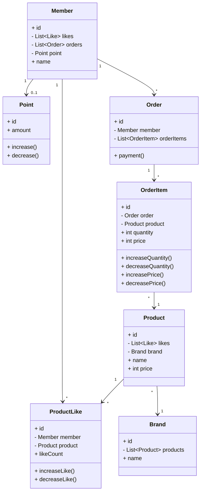

```mermaid
classDiagram
    class Member {
        + id
        - List~Like~ likes
        - List~Order~ orders
        - Point point
        + name
    }

    class ProductLike {
        + id
        - Member member
        - Product product
        + likeCount
        + increaseLike()
        + decreaseLike()
    }

    class Point {
        + id
        + amount
        + increase()
        + decrease()
    }
 
    class Order {
        + id
        - Member member
        - List~OrderItem~ orderItems
        + payment()
    }

    class OrderItem {
        + id
        - Order order
        - Product product
        + int quantity
        + int price
        + increaseQuantity()
        + decreaseQuantity()
        + increasePrice()
        + decreasePrice()
    }

    class Product {
        + id
        - List~Like~ likes
        - Brand brand
        + name
        + int price
    }

    class Brand {
        + id
        - List~Product~ products
        + name
    }

    %% 관계 표현
    Member "1" --> "*" ProductLike
    Member "1" --> "0..1" Point
    Member "1" --> "*" Order
    Product "1" --> "*" ProductLike
    Product "*" --> "1" Brand
    Order "1" --> "*" OrderItem
    OrderItem "*" --> "1" Product

```