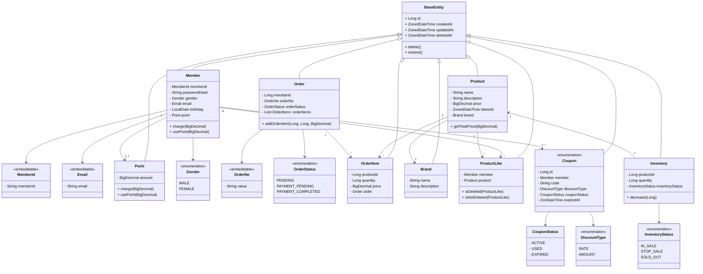

```mermaid
classDiagram
    class BaseEntity {
        + Long id
        + ZonedDateTime createdAt
        + ZonedDateTime updatedAt
        + ZonedDateTime deletedAt
        + delete()
        + restore()
    }

    class Member {
        - MemberId memberId
        - String passwordHash
        - Gender gender
        - Email email
        - LocalDate birthday
        - Point point
        + charge(BigDecimal)
        + usePoint(BigDecimal)
    }

    class MemberId {
        <<embeddable>>
        - String memberId
    }

    class Email {
        <<embeddable>>
        - String email
    }

    class Point {
        - BigDecimal amount
        + charge(BigDecimal)
        + usePoint(BigDecimal)
    }

    class Gender {
        <<enumeration>>
        MALE
        FEMALE
    }
 
    class Order {
        - Long memberId
        - OrderNo orderNo
        - OrderStatus orderStatus
        - List~OrderItem~ orderItems
        + addOrderItem(Long, Long, BigDecimal)
    }

    class OrderNo {
        <<embeddable>>
        - String value
    }

    class OrderStatus {
        <<enumeration>>
        PENDING
        PAYMENT_PENDING
        PAYMENT_COMPLETED
    }

    class OrderItem {
        - Long productId
        - Long quantity
        - BigDecimal price
        - Order order
    }

    class Product {
        - String name
        - String description
        - BigDecimal price
        - ZonedDateTime latestAt
        - Brand brand
        + getTotalPrice(BigDecimal)
    }

    class Brand {
        - String name
        - String description
    }

    class ProductLike {
        - Member member
        - Product product
        + isDeleted(ProductLike)
        + isNotDeleted(ProductLike)
    }

    class Inventory {
        - Long productId
        - Long quantity
        - InventoryStatus inventoryStatus
        + decrease(Long)
    }

    class InventoryStatus {
        <<enumeration>>
        IN_SALE
        STOP_SALE
        SOLD_OUT
    }
    
    class Coupon {
        <<enumeration>>
        - Long id
        - Member member
        - String code
        - DiscountType discountType
        - CouponStatus couponStatus
        - ZonDateTime expiredAt
    }
    
    class DiscountType {
        <<enumeration>>
        RATE
        AMOUNT
    }
    
    class CouponStatus {
        - ACTIVE
        - USED
        - EXPIRED
    }

    %% 상속 관계
    BaseEntity <|-- Member
    BaseEntity <|-- Point
    BaseEntity <|-- Order
    BaseEntity <|-- OrderItem
    BaseEntity <|-- Product
    BaseEntity <|-- Brand
    BaseEntity <|-- ProductLike
    BaseEntity <|-- Inventory
    BaseEntity <|-- Coupon

    %% 관계 표현
    Member "1" --> "0..1" Point
    Member "1" --> "*" ProductLike
    Member "1" --> "0..*" Coupon
    Member --> Gender
    Member --> MemberId
    Member --> Email
    Product "1" --> "*" ProductLike
    Product "*" --> "1" Brand
    Product "1" --> "*" OrderItem
    Product "1" <-- "1" Inventory
    Inventory --> InventoryStatus
    Order "1" --> "*" OrderItem
    Order  --> OrderStatus
    Order --> OrderNo
    Coupon --> CouponStatus
    Coupon --> DiscountType
```