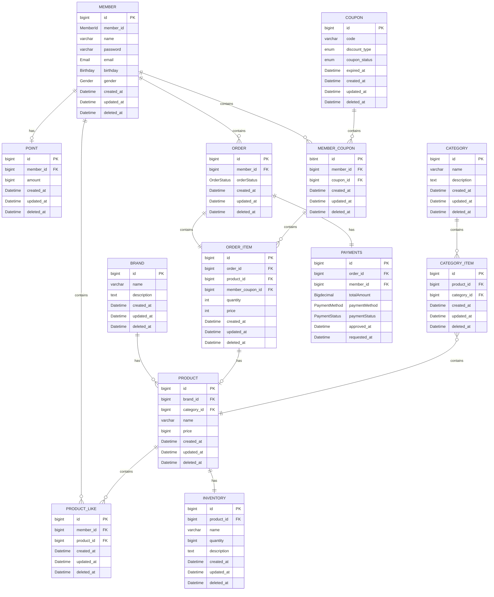

```mermaid
erDiagram
    MEMBER {
        bigint id PK
        MemberId member_id
        varchar name
        varchar password
        Email email
        Birthday birthday
        Gender gender
        
        Datetime created_at
        Datetime updated_at
        Datetime deleted_at
    }
    
    PRODUCT_LIKE {
        bigint id PK
        bigint member_id FK
        bigint product_id FK
        
        Datetime created_at
        Datetime updated_at
        Datetime deleted_at
    }
    
    POINT {
        bigint id PK
        bigint member_id FK
        bigint amount
        
        Datetime created_at
        Datetime updated_at
        Datetime deleted_at
    }
    
    ORDER {
        bigint id PK
        bigint member_id FK
        OrderStatus orderStatus
        
        Datetime created_at
        Datetime updated_at
        Datetime deleted_at
    }
    
    ORDER_ITEM {
        bigint id PK
        bigint order_id FK
        bigint product_id FK
        bigint member_coupon_id FK
        int quantity
        int price
        
        Datetime created_at
        Datetime updated_at
        Datetime deleted_at
    }
    
    PRODUCT {
        bigint id PK
        bigint brand_id FK
        bigint category_id FK
        varchar name
        bigint price
        
        Datetime created_at
        Datetime updated_at
        Datetime deleted_at
    }

    CATEGORY {
        bigint id PK
        varchar name
        text description

        Datetime created_at
        Datetime updated_at
        Datetime deleted_at
    }
    
    CATEGORY_ITEM {
        bigint id PK
        bigint product_id FK
        bigint category_id FK

        Datetime created_at
        Datetime updated_at
        Datetime deleted_at
    }

    INVENTORY {
        bigint id PK
        bigint product_id FK
        varchar name
        bigint quantity
        text description

        Datetime created_at
        Datetime updated_at
        Datetime deleted_at
    }
    
    BRAND {
        bigint id PK
        varchar name
        text description
        
        Datetime created_at
        Datetime updated_at
        Datetime deleted_at
    }
    
    MEMBER_COUPON {
        bitint id PK
        bigint member_id FK
        bigint coupon_id FK

        Datetime created_at
        Datetime updated_at
        Datetime deleted_at
    }
    
    COUPON {
        bigint id PK
        varchar code
        enum discount_type
        enum coupon_status
        Datetime expired_at

        Datetime created_at
        Datetime updated_at
        Datetime deleted_at
    }
    
    PAYMENTS {
        bigint id PK
        bigint order_id FK
        bigint member_id FK
        Bigdecimal totalAmount
        PaymentMethod paymentMethod
        PaymentStatus paymentStatus

        Datetime approved_at
        Datetime requested_at
    }
    
    MEMBER ||--o| POINT : has
    MEMBER ||--o{ PRODUCT_LIKE : contains
    MEMBER ||--o{ ORDER : contains
    MEMBER ||--o{ MEMBER_COUPON : contains
    COUPON ||--o{ MEMBER_COUPON : contains
    ORDER ||--|| ORDER_ITEM : contains
    PRODUCT ||--o{ PRODUCT_LIKE : contains
    BRAND ||--o{ PRODUCT : has
    ORDER_ITEM ||--o| PRODUCT : has
    PRODUCT ||--|| INVENTORY : has
    CATEGORY ||--o{ CATEGORY_ITEM : contains
    CATEGORY_ITEM }o-- || PRODUCT : contains
    ORDER ||--|| PAYMENTS : has
    MEMBER_COUPON ||--o{ ORDER_ITEM : contains
```
